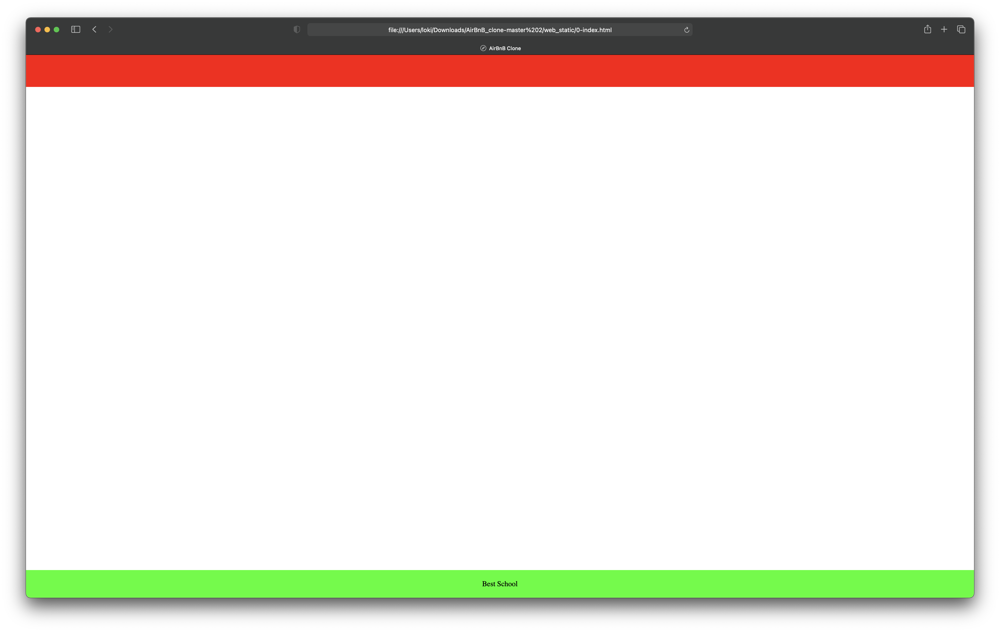
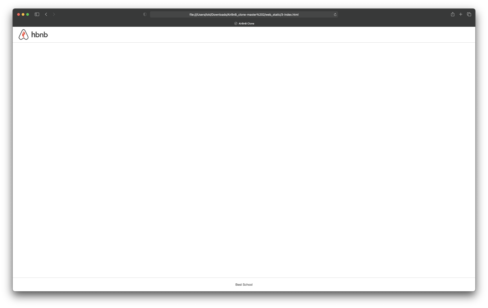
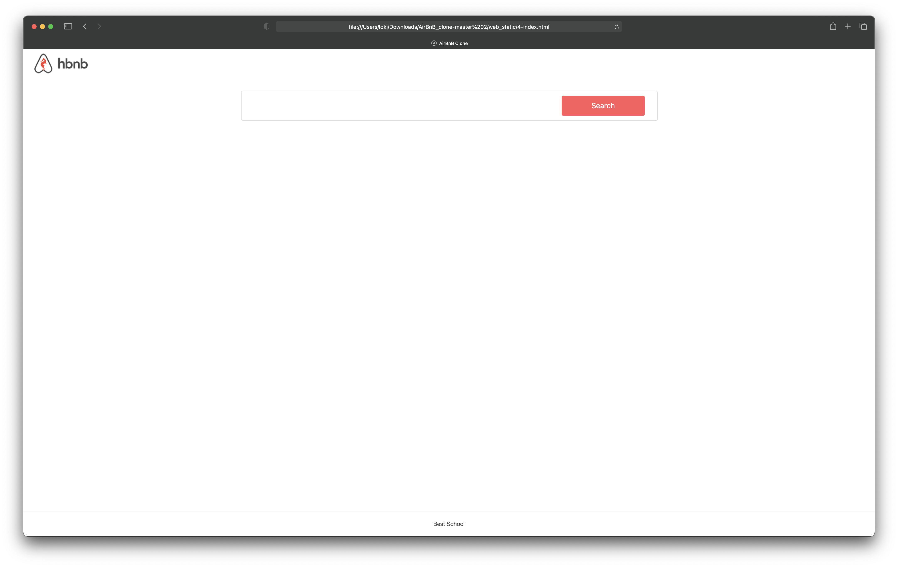
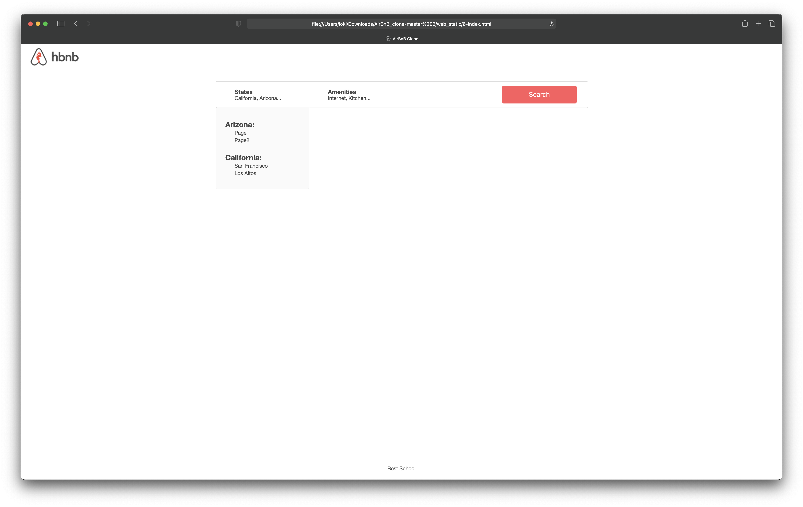
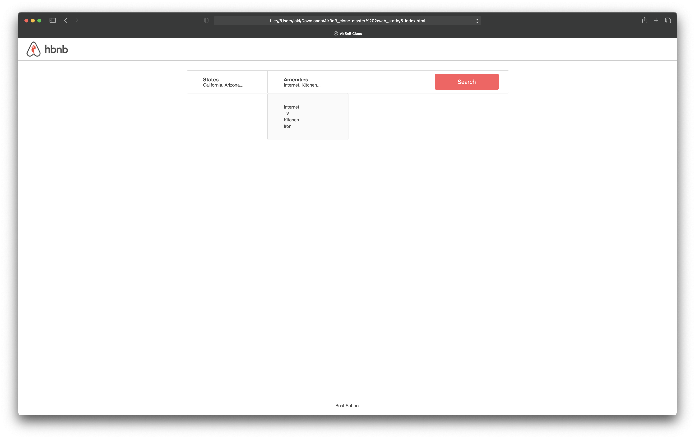
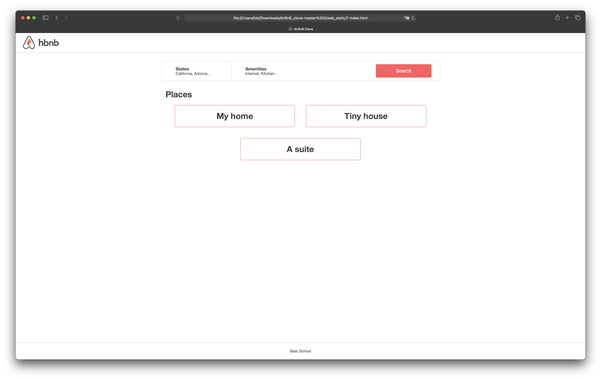
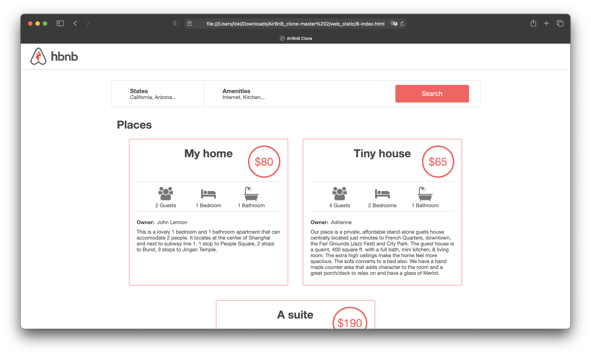
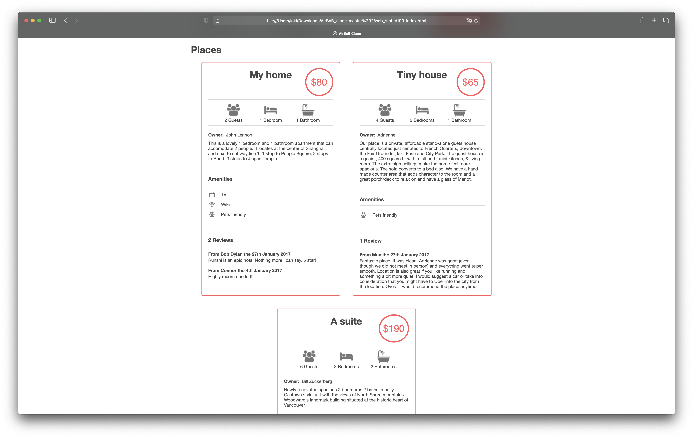

# Concepts

*For this project, we expect you to look at these concepts:*

- [HTML/CSS]()
- [The trinity of front-end quality]()

# Background Context

**Web static, what?**

Now that you have a command interpreter for managing your AirBnB objects, it’s time to make them alive!

Before developing a big and complex web application, we will build the front end step-by-step.

The first step is to “design” / “sketch” / “prototype” each element:

- Create simple HTML static pages
- Style guide
- Fake contents
- No Javascript
- No data loaded from anything

During this project, you will learn how to manipulate HTML and CSS languages. HTML is the structure of your page, it should be the first thing to write. CSS is the styling of your page, the design. I really encourage you to fix your HTML part before starting the styling. Indeed, without any structure, you can’t apply any design.

Before starting, please fork or clone the repository `AirBnB_clone` from your partner if you were not the owner of the previous project.

# Resources
## Read or watch:
- [Learn to Code HTML & CSS](https://intranet.alxswe.com/rltoken/T9KyiA6_Tm3Ny6oTn08S-A) (*until “Creating Lists” included*)
- [Inline Styles in HTML]()
- [Specifics on CSS Specificity]()
- [CSS SpeciFishity]()
- [Introduction to HTML]()
- [CSS]()
- [MDN]()
- [center boxes]()

# Learning Objectives
At the end of this project, you are expected to be able to [explain to anyone](https://intranet.alxswe.com/rltoken/Zb9sTIct2xdhDCDLGF-RyQ), **without the help of Google:**

## General
- What is HTML
- How to create an HTML page
- What is a markup language
- What is the DOM
- What is an element / tag
- What is an attribute
- How does the browser load a webpage
- What is CSS
- How to add style to an element
- What is a class
- What is a selector
- How to compute CSS Specificity Value
- What are Box properties in CSS

# Requirements

## General
- Allowed editors: `vi`, `vim`, `emacs`
- All your files should end with a new line
- A `README.md` file, at the root of the folder of the project, is mandatory
- Your code should be W3C compliant and validate with [W3C-Validator](https://intranet.alxswe.com/rltoken/RGLQtJVf7Ga3mU8NX9zADQ)
- All your CSS files should be in `styles` folder
- All your images should be in `images` folder
- You are not allowed to use `!important` and `id` (`#...` in the CSS file)
- You are not allowed to use tags `img`, `embed` and `iframe`
- You are not allowed to use Javascript
- Current screenshots have been done on `Chrome 56` or more.
- No cross browsers
- You have to follow all requirements but some `margin`/`padding` are missing - you should try to fit as much as you can to screenshots

## More Info

Quiz questions
Great! You've completed the quiz successfully! Keep going! (Show quiz)

## Tasks

### 0. Inline styling

Write an HTML page that displays a header and a footer.

Layout:

- Body:
	- no margin
	- no padding
- Header:
	- color #FF0000 (red)
	- height: 70px
	- width: 100%
- Footer:
	- color #00FF00 (green)
	- height: 60px
	- width: 100%
	- text `Best School` center vertically and horizontally
	- always at the bottom at the page

Requirements:
- You must use the `header` and `footer` tags
- You are not allowed to import any files
- You are not allowed to use the `style tag` in the `head` tag
- Use inline styling for all your tags

**Repo:**
- GitHub repository: `AirBnB_clone`
- Directory: `web_static`
- File: `0-index.html`

### 1. Head styling

Write an HTML page that displays a header and a footer by using the `style` tag in the `head` tag (same as `0-index.html`)

Requirements:
- You must use the `header` and `footer` tags
- You are not allowed to import any files
- No inline styling
- You must use the `style` tag in the `head` tag

The layout must be exactly the same as `0-index.html`

**Repo:**
- GitHub repository: `AirBnB_clone`
- Directory: `web_static`
- File: `1-index.html`

### 2. CSS files

Write an HTML page that displays a header and a footer by using CSS files (same as `1-index.html`)

Requirements:
- You must use the `header` and `footer` tags
- No inline styling
- You must have 3 CSS files:
	- `styles/2-common.css`: for global style (i.e. the `body` style)
	- `styles/2-header.css`: for header style
	- `styles/2-footer.css`: for footer style

The layout must be exactly the same as `1-index.html`

**Repo:**
- GitHub repository: `AirBnB_clone`
- Directory: `web_static`
- File: `2-index.html, styles/2-common.css, styles/2-header.css, styles/2-footer.css`

### 3. Zoning done!

Write an HTML page that displays a header and footer by using CSS files (same as `2-index.html`)

Layout:

- Common:
	- no margin
	- no padding
	- font color: #484848
	- font size: 14px
	- font family: `Circular,"Helvetica Neue",Helvetica,Arial,sans-serif;`
	- [icon](https://s3.amazonaws.com/intranet-projects-files/holbertonschool-higher-level_programming+/268/icon.png) in the browser tab
- Header:
	- color: white
	- height: 70px
	- width: 100%
	- border bottom 1px #CCCCCC
	- [logo](https://s3.amazonaws.com/intranet-projects-files/holbertonschool-higher-level_programming+/268/logo.png) align on left and center vertically (20px space at the left)
- Footer:
	- color white
	- height: 60px
	- width: 100%
	- border top 1px #CCCCCC
	- text `Best School` center vertically and horizontally
	- always at the bottom at the page

Requirements:
- No inline style
- You are not allowed to use the `img` tag
- You are not allowed to use the `style` tag in the `head` tag
- All images must be stored in the `images` folder
- You must have 3 CSS files:
	- `styles/3-common.css`: for the global style (i.e `body` style)
	- `styles/3-header.css`: for the header style
	- `styles/3-footer.css`: for the footer style

**Repo:**
- GitHub repository: `AirBnB_clone`
- Directory: `web_static`
- File: `3-index.html, styles/3-common.css, styles/3-header.css, styles/3-footer.css, images/`

### 4. Search!

Write an HTML page that displays a header, footer and a filters box with a search button.

Layout: (based on `3-index.html`)

- Container:
	- between `header` and `footer` tags, add a `div`:
		- classname: `container`
		- max width 1000px
		- margin top and bottom 30px - it should be 30px under the bottom of the `header` (screenshot)
		- center horizontally
- Filter section:
	- tag `section`
	- classname `filters`
	- inside the `.container`
	- color white
	- height: 70px
	- width: 100% of the container
	- border 1px #DDDDDD with radius 4px
- Button search:
	- tag `button`
	- text `Search`
	- font size: 18px
	- inside the section filters
	- background color #FF5A5F
	- text color #FFFFFF
	- height: 48px
	- width: 20% of the section filters
	- no borders
	- border radius: 4px
	- center vertically and at 30px of the right border
	- change opacity to 90% when the mouse is on the button

Requirements:
- You must use: `header`, `footer`, `section`, `button` tags
- No inline style
- You are not allowed to use the `img` tag
- You are not allowed to use the `style` tag in the `head` tag
- All images must be stored in the `images` folder
- You must have 4 CSS files:
	- `styles/4-common.css`: for the global style (`body` and `.container` styles)
	- `styles/3-header.css`: for the header style
	- `styles/3-footer.css`: for the footer style
	- `styles/4-filters.css`: for the filters style
- `4-index.html` won’t be **W3C valid**, don’t worry, it’s temporary

**Repo:**
- GitHub repository: `AirBnB_clone`
- Directory: `web_static`
- File: `4-index.html, styles/4-common.css, styles/3-header.css, styles/3-footer.css, styles/4-filters.css, images/`

### 5. More filters

Write an HTML page that displays a header, footer and a filters box.

Layout: (based on `4-index.html`)

- Locations and Amenities filters:
	- tag: `div`
	- classname: `locations` for location tag and `amenities` for the other
	- inside the section filters (same level as the `button` Search)
	- height: 100% of the section filters
	- width: 25% of the section filters
	- border right #DDDDDD 1px only for the first left filter
	- contains a title:
		- tag: `h3`
		- font weight: 600
		- text `States` or `Amenities`
	- contains a subtitle:
		- tag: `h4`
		- font weight: 400
		- font size: 14px
		- text with fake contents

Requirements:
- You must use: `header`, `footer`, `section`, `button`, `h3`, `h4` tags
- No inline style
- You are not allowed to use the `img` tag
- You are not allowed to use the `style` tag in the `head` tag
- All images must be stored in the `images` folder
- You must have 4 CSS files:
	`styles/4-common.css`: for the global style (`body` and `.container` styles)
	`styles/3-header.css`: for the header style
	`styles/3-footer.css`: for the footer style
	`styles/5-filters.css`: for the filters style

**Repo:**
- GitHub repository: `AirBnB_clone`
- Directory: `web_static`
- File: `5-index.html, styles/4-common.css, styles/3-header.css, styles/3-footer.css, styles/5-filters.css, images/`

### 6. It's (h)over

Write an HTML page that displays a header, footer and a filters box with dropdown.

Layout: (based on `5-index.html`)

- Update Locations and Amenities filters to display a contextual dropdown when the mouse is on the filter `div`:
	- tag `ul`
	- classname `popover`
	- text should be fake now
	- inside each `div`
	- not displayed by default
	- color #FAFAFA
	- width same as the `div` filter
	- border #DDDDDD 1px with border radius 4px
	- no list display
	- Location filter has 2 levels of `ul`/`li`:
		- state -> cities
		- state name must be display in a `h2` tag (font size 16px)

Requirements:
- You must use: `header`, `footer`, `section`, `button`, `h3`, `h4`, `ul`, `li` tags
- No inline style
- You are not allowed to use the `img` tag
- You are not allowed to use the `style` tag in the head tag
- All images must be stored in the `images` folder
	- You must have 4 CSS files:
	- `styles/4-common.css`: for the global style (`body` and `.container` styles)
	- `styles/3-header.css`: for the header style
	- `styles/3-footer.css`: for the footer style
	- `styles/6-filters.css`: for the filters style

**Repo:**
- GitHub repository: `AirBnB_clone`
- Directory: `web_static`
- File: `6-index.html, styles/4-common.css, styles/3-header.css, styles/3-footer.css, styles/6-filters.css, images/`

### 7. Display results

Write an HTML page that displays a header, footer, a filters box with dropdown and results.

Layout: (based on `6-index.html`)

- Add Places section:
	- tag: `section`
	- classname: `places`
	- same level as the filters section, inside `.container`
	- contains a title:
		- tag: `h1`
		- text: `Places`
		- align in the top left
		- font size: 30px
	- contains multiple “Places” as listing (horizontal or vertical) describe by:
		- tag: `article`
		- width: 390px
		- padding and margin 20px
		- border #FF5A5F 1px with radius 4px
		- contains the place name:
			- tag: `h2`
			- font size: 30px
			- center horizontally

Requirements:
- You must use: `header`, `footer`, `section`, `article`, `button`, `h1`, `h2`, `h3`, `h4`, `ul`, `li` tags
- No inline style
- You are not allowed to use the `img` tag
- You are not allowed to use the `style` tag in the head tag
- All images must be stored in the `images` folder
- You must have 5 CSS files:
	- `styles/4-common.css`: for the global style (i.e. `body` and `.container` styles)
	- `styles/3-header.css`: for the header style
	- `styles/3-footer.css`: for footer style
	- `styles/6-filters.css`: for the filters style
	- `styles/7-places.css`: for the places style

**Repo:**
- GitHub repository: `AirBnB_clone`
- Directory: `web_static`
- File: `7-index.html, styles/4-common.css, styles/3-header.css, styles/3-footer.css, styles/6-filters.css, styles/7-places.css, images/`

### 8. More details

Write an HTML page that displays a header, a footer, a filter box (dropdown list) and the result of the search.

Layout: (based on `7-index.html`)

Add more information to a Place `article`:

- Price by night:
	- tag: `div`
	- classname: `price_by_night`
	- same level as the place name
	- font color: #FF5A5F
	- border: #FF5A5F 4px rounded
	- min width: 60px
	- height: 60px
	- font size: 30px
	- align: the top right (with space)
- Information section:
	- tag: `div`
	- classname: `information`
	- height: 80px
	- border: top and bottom #DDDDDD 1px
	- contains (align vertically):
		- Number of guests:
			- tag: `div`
			- classname: `max_guest`
			- width: 100px
			- fake text
			- [icon](https://s3.amazonaws.com/intranet-projects-files/holbertonschool-higher-level_programming+/268/icon_group.png)
		- Number of bedrooms:
			- tag: div
			- classname: number_rooms
			- width: 100px
			- fake text
			- [icon](https://s3.amazonaws.com/intranet-projects-files/holbertonschool-higher-level_programming+/268/icon_bed.png)
		- Number of bathrooms:
			- tag: div
			- classname: number_bathrooms
			- width: 100px
			- fake text
			- [icon](https://s3.amazonaws.com/intranet-projects-files/holbertonschool-higher-level_programming+/268/icon_bath.png)

- User section:
	- tag: `div`
	- classname: `user`
	- text `Owner: <fake text>`
	- `Owner` text should be in bold
- Description section:
	- tag: `div`
	- classname: `description`

Requirements:
- You must use: `header`, `footer`, `section`, `article`, `button`, `h1`, `h2`, `h3`, `h4`, `ul`, `li` tags
- No inline style
- You are not allowed to use the `img` tag
- You are not allowed to use the `style` tag in the `head` tag
- All images must be stored in the `images` folder
- You must have 5 CSS files:
	- `styles/4-common.css`: for the global style (i.e. `body` and `.container` styles)
	- `styles/3-header.css`: for the header style
	- `styles/3-footer.css`: for the footer style
	- `styles/6-filters.css`: for the filters style
	- `styles/8-places.css`: for the places style

**Repo:**
- GitHub repository: `AirBnB_clone`
- Directory: `web_static`
- File: `8-index.html, styles/4-common.css, styles/3-header.css, styles/3-footer.css, styles/6-filters.css, styles/8-places.css, images/`

### 9. Full details

Write an HTML page that displays a header, footer, a filters box with dropdown and results.

Layout: (based on `8-index.html`)

Add more information to a Place `article`:

- List of Amenities:
	- tag `div`
	- classname `amenities`
	- margin top 40px
	- contains:
		- title:
			- tag `h2`
			- text `Amenities`
			- font size 16px
			- border bottom #DDDDDD 1px
		- list of amenities:
			- tag `ul` / `li`
			- no list style
			- icons on the left: [Pet friendly](https://s3.amazonaws.com/intranet-projects-files/holbertonschool-higher-level_programming+/268/icon_pets.png), [TV](https://s3.amazonaws.com/intranet-projects-files/holbertonschool-higher-level_programming+/268/icon_tv.png), [Wifi](https://s3.amazonaws.com/intranet-projects-files/holbertonschool-higher-level_programming+/268/icon_wifi.png), etc… feel free to add more
- List of Reviews:
	- tag `div`
	- classname `reviews`
	- margin top 40px
	- contains:
		- title:
			- tag `h2`
			- text `Reviews`
			- font size 16px
			- border bottom #DDDDDD 1px
		- list of review:
			- tag `ul` / `li`
			- no list style
			- a review is described by:
				- `h3` tag for the user/date description (font size 14px). Ex: “From Bob Dylan the 27th January 2017”
				- `p` tag for the text (font size 12px)
Requirements:
- You must use: `header`, `footer`, `section`, `article`, `button`, `h1`, `h2`, `h3`, `h4`, `ul`, `li` tags
- No inline style
- You are not allowed to use the `img` tag
- You are not allowed to use the `style` tag in the `head` tag
- All images must be stored in the `images` folder
- You must have 5 CSS files:
	- `styles/4-common.css`: for the global style (`body` and `.container` styles)
	- `styles/3-header.css`: for the header style
	- `styles/3-footer.css`: for the footer style
	- `styles/6-filters.css`: for the filters style
	- `styles/100-places.css`: for the places style

**Repo:**
- GitHub repository: `AirBnB_clone`
- Directory: `web_static`
- File: `100-index.html, styles/4-common.css, styles/3-header.css, styles/3-footer.css, styles/6-filters.css, styles/100-places.css, images/`

### 10. Flex

Improve the Places section by using [Flexible boxes](https://intranet.alxswe.com/rltoken/Xc-nBlQHexwNaCuKYpZ2-A) for all Place articles

[Flexbox Froggy](https://intranet.alxswe.com/rltoken/PZz46Gkdj5Mo9-AWERPhQA)

**Repo:**
- GitHub repository: `AirBnB_clone`
- Directory: `web_static`
- File: `101-index.html, styles/4-common.css, styles/3-header.css, styles/3-footer.css, styles/6-filters.css, styles/101-places.css, images/`

### 11. Responsive design

Improve the page by adding [responsive design](https://intranet.alxswe.com/rltoken/9mRhZcLRxmsuCyF8q7S8Ww) to display correctly in mobile or small screens.

Examples:
- no horizontal scrolling
- redesign search bar depending of the width
- etc.

**Repo:**
- GitHub repository: `AirBnB_clone`
- Directory: `web_static`
- File: `102-index.html, styles/102-common.css, styles/102-header.css, styles/102-footer.css, styles/102-filters.css, styles/102-places.css, images/`

### 12. Accessibility

Improve the page by adding [Accessibility support](https://intranet.alxswe.com/rltoken/JO-zonPvzBUfqpYRZDAtug)

Examples:
- Colors contrast
- Header tags
- etc.

Well done on completing this project! Let the world hear about this milestone achieved.

[Click here to tweet!](https://twitter.com/intent/tweet?text=I+have+successfully+completed+my+AirBnB+Web+Static+project+on+%23ALX_SE+%40facesofalxse)

**Repo:**
- GitHub repository: `AirBnB_clone`
- Directory: `web_static`
- File: `103-index.html, styles/103-common.css, styles/103-header.css, styles/103-footer.css, styles/103-filters.css, styles/103-places.css, images/`
