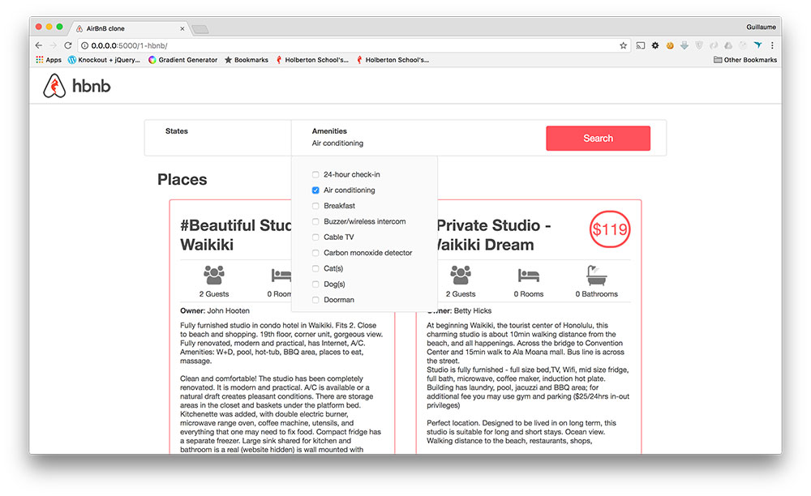
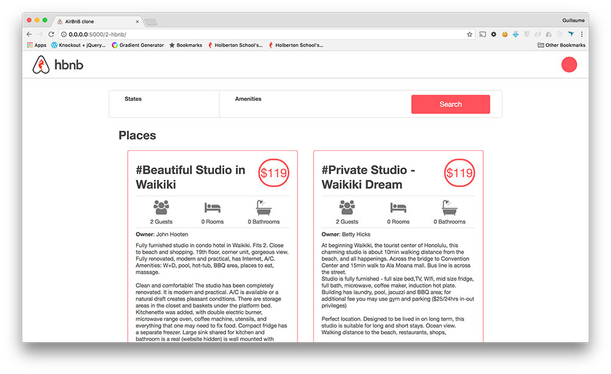

# Concepts

*For this project, we expect you to look at this concept:*

- [AirBnB clone](https://intranet.alxswe.com/concepts/74)

# Resources
## Read or watch:
- [Selector](https://intranet.alxswe.com/rltoken/Bl2mJVVG07XCP6E8qtsQMg)
- [Get and set content](https://intranet.alxswe.com/rltoken/oM3b0a0FGTy6AQ_UJ201Yw)
- [Manipulate CSS classes](https://intranet.alxswe.com/rltoken/LL2uScQvjWnj2ZEx2CzxXw)
- [Manipulate DOM elements](https://intranet.alxswe.com/rltoken/6JtTz9SaNX3AyVXht4tMYA)
- [Document ready](https://intranet.alxswe.com/rltoken/1AbzN1nEfBKoSjB-9kjmrA)
- [Introduction](https://intranet.alxswe.com/rltoken/OGDoIOd0cdmwDJFJy4aw5w)
- [GET & POST request](https://intranet.alxswe.com/rltoken/kmBzs_QPD72Oz--Yk80JHw)
- [HTTP access control (CORS)](https://intranet.alxswe.com/rltoken/tzqJx5SS5cF1BW_lAnXqqg)

## Learning Objectives
At the end of this project, you are expected to be able to [explain to anyone](https://intranet.alxswe.com/rltoken/_ii906pZ1sg8gkAF1dvsNQ), **without the help of Google:**

## General
- How cool it is to request your own API
- How to modify an HTML element style
- How to get and update an HTML element content
- How to modify the DOM
- How to make a `GET` request with JQuery Ajax
- How to make a `POST` request with JQuery Ajax
- How to listen/bind to DOM events
- How to listen/bind to user events

# Requirements
## General
- Allowed editors: `vi`, `vim`, `emacs`
- All your files will be interpreted on Chrome (version 57.0)
- All your files should end with a new line
- A `README.md` file, at the root of the folder of the project, is mandatory
- Your code should be `semistandard` compliant with the flag `--global $: semistandard *.js --global $`
- All your JavaScript must be in the folder `scripts`
- You must use JQuery version 3.x
- You are not allowed to use `var`
- HTML should not reload for each action: DOM manipulation, update values, fetch data…

# More Info

## Import JQuery

```html
<head>
    <script src="https://code.jquery.com/jquery-3.2.1.min.js"></script>
</head>
```

### Before starting the project…

You will work on a codebase using [Flasgger](https://intranet.alxswe.com/rltoken/VmGDpw_DCN16OJt_UoqsDQ), you will need to install it locally first before starting the RestAPI:

```bash
$ sudo apt-get install -y python3-lxml
$ sudo pip3 install flask_cors # if it was not installed yet
$ sudo pip3 install flasgger
```

If the RestAPI is not starting, please read the error message. Based on the(ses) error message(s), you will have to troubleshoot potential dependencies issues.

Here are some solutions:

## jsonschema `exception`

```bash
$ sudo pip3 uninstall -y jsonschema
$ sudo pip3 install jsonschema==3.0.1
```

## No module named 'pathlib2'

```
$ sudo pip3 install pathlib2
```

### Expose ports from your Vagrant

In your `Vagrantfile`, add this line for each port forwarded

```
# I expose the port 5001 of my vm to the port 5001 on my computer
config.vm.network :forwarded_port, guest: 5001, host: 5001
```

if you need to expose other ports, same line but you will need to replace the “guest port” (inside your vagrant) and your “host port” (outside your vagrant, used from your browser for example)

It’s important in your project, to use the AirBnB API with the port `5001`


## Tasks

### 0. Last clone!

A new codebase again? Yes!

For this project you will fork this [codebase](https://intranet.alxswe.com/rltoken/18CpThAKqBP5uviO1DSSGw):

- Update the repository name to `AirBnB_clone_v4`
- Update the `README.md`:
	- Add yourself as an author of the project
	- Add new information about your new contribution
	- Make it better!
- If you’re the owner of this codebase, create a new repository called `AirBnB_clone_v4` and copy over all files from `AirBnB_clone_v3`
- If you didn’t install Flasgger from the previous project, it’s time! `sudo pip3 install flasgger`

**Repo:**
- GitHub repository: `AirBnB_clone_v4`

### 1. Cash only

Write a script that starts a Flask web application:

- Based on web_flask, copy: `web_flask/static`, `web_flask/templates/100-hbnb.html`, `web_flask/__init__.py` and `web_flask/100-hbnb.py` into the `web_dynamic` folder
- Rename `100-hbnb.py` to `0-hbnb.py`
- Rename `100-hbnb.html` to `0-hbnb.html`
- Update 0-hbnb.py to replace the existing route to `/0-hbnb/`

**If `100-hbnb.html` is not present, use `8-hbnb.html` instead**

```
guillaume@ubuntu:~/AirBnB_v4$ HBNB_MYSQL_USER=hbnb_dev HBNB_MYSQL_PWD=hbnb_dev_pwd HBNB_MYSQL_HOST=localhost HBNB_MYSQL_DB=hbnb_dev_db HBNB_TYPE_STORAGE=db python3 -m web_dynamic.0-hbnb
* Running on http://0.0.0.0:5000/ (Press CTRL+C to quit)
....
```

One problem now is the asset caching done by Flask.

To avoid that, you will add a query string to each asset:

In `0-hbnb.py`, add a variable `cache_id` to the `render_template`. The value of this variable must be an UUID (`uuid.uuid4()`)

In `0-hbnb.html`, add this variable `cache_id` as query string to each `<link>` tag URL

```
guillaume@ubuntu:~/AirBnB_v4$ curl -s -XGET http://0.0.0.0:5000/0-hbnb/ | head -6
<!DOCTYPE HTML>
<html lang="en">
  <head>
    <meta charset="UTF-8" />
    <link rel="stylesheet" type="text/css" href="../static/styles/4-common.css?e211c9eb-7d17-4f12-85eb-4d50fa50cb1d" />
    <link rel="stylesheet" type="text/css" href="../static/styles/3-header.css?e211c9eb-7d17-4f12-85eb-4d50fa50cb1d" />
guillaume@ubuntu:~/AirBnB_v4$ curl -s -XGET http://0.0.0.0:5000/0-hbnb/ | head -6
<!DOCTYPE HTML>
<html lang="en">
  <head>
    <meta charset="UTF-8" />
    <link rel="stylesheet" type="text/css" href="../static/styles/4-common.css?f834413e-0aa9-4767-b64a-c92db9cb1f82" />
    <link rel="stylesheet" type="text/css" href="../static/styles/3-header.css?f834413e-0aa9-4767-b64a-c92db9cb1f82" />
guillaume@ubuntu:~/AirBnB_v4$
```

**Repo:**
- GitHub repository: `AirBnB_clone_v4`
- Directory: `web_dynamic`
- File: `0-hbnb.py, templates/0-hbnb.html`

### 2. Select some Amenities to be comfortable!

For the moment the filters section is static, let’s make it dynamic!

Replace the route `0-hbnb` with `1-hbnb` in the file `1-hbnb.py` (based on `0-hbnb.py`)

Create a new template `1-hbnb.html` (based on `0-hbnb.html`) and update it:

- Import JQuery in the `<head>` tag
- Import the JavaScript `static/scripts/1-hbnb.js` in the `<head>` tag
	- In 1-hbnb.html and the following HTML files, add this variable `cache_id` as query string to the above `<script>` tag
- Add a `<input type="checkbox">` tag to the `li` tag of each amenity
- The new checkbox must be at 10px on the left of the Amenity name
- Add to the `input` tags of each amenity (`<li>` tag) the attribute `data-id=":amenity_id"` => this will allow us to retrieve the Amenity ID from the DOM
- Add to the `input` tags of each amenity (`<li>` tag) the attribute `data-name=":amenity_name"` => this will allow us to retrieve the Amenity name from the DOM

Write a JavaScript script (`static/scripts/1-hbnb.js`):

- Your script must be executed only when DOM is loaded
- You must use JQuery
- Listen for changes on each `input` checkbox tag:
	- if the checkbox is checked, you must store the Amenity ID in a variable (dictionary or list)
	- if the checkbox is unchecked, you must remove the Amenity ID from the variable
	- update the `h4` tag inside the `div` Amenities with the list of Amenities checked

As example:





**Repo:**
- GitHub repository: `AirBnB_clone_v4`
- Directory: `web_dynamic`
- File: `1-hbnb.py, templates/1-hbnb.html, static/scripts/1-hbnb.js`

### 3. API status

Before requesting the HBNB API, it’s better to know the status of this one.

Update the API entry point (`api/v1/app.py`) by replacing the current CORS `CORS(app, origins="0.0.0.0"`) by `CORS(app, resources={r"/api/v1/*": {"origins": "*"}})`.

Change the route `1-hbnb` to `2-hbnb` in the file `2-hbnb.py` (based on `1-hbnb.py`)

Create a new template `2-hbnb.html` (based on `1-hbnb.html`) and update it:

- Import the JavaScript `static/scripts/2-hbnb.js` in the `<head>` tag (instead of `1-hbnb.js`)
- Add a new `div` element in the `header` tag:
	- Attribute ID should be `api_status`
	- Align to the right
	- Circle of 40px diameter
	- Center vertically
	- At 30px of the right border
	- Background color #cccccc
- Also add a class `available` for this new element in `web_dynamic/static/styles/3-header.css`:
	- Background color #ff545f

Write a JavaScript script (`static/scripts/2-hbnb.js`):

- Based on `1-hbnb.js`
- Request `http://0.0.0.0:5001/api/v1/status/`:
	- If in the status is “OK”, add the class `available` to the `div#api_status`
	- Otherwise, remove the class `available` to the `div#api_status`

To start the API in the port 5001:

```
guillaume@ubuntu:~/AirBnB_v4$ HBNB_MYSQL_USER=hbnb_dev HBNB_MYSQL_PWD=hbnb_dev_pwd HBNB_MYSQL_HOST=localhost HBNB_MYSQL_DB=hbnb_dev_db HBNB_TYPE_STORAGE=db HBNB_API_PORT=5001 python3 -m api.v1.app
...
```

For example:




**Repo:**
- GitHub repository: `AirBnB_clone_v4`
- File: `api/v1/app.py, web_dynamic/2-hbnb.py, web_dynamic/templates/2-hbnb.html, web_dynamic/static/styles/3-header.css, web_dynamic/static/scripts/2-hbnb.js`

### 4. Fetch places

Replace the route `2-hbnb` with `3-hbnb` in the file `3-hbnb.py` (based on `2-hbnb.py`)

Create a new template `3-hbnb.html` (based on `2-hbnb.html`) and update it:

- Import the JavaScript `static/scripts/3-hbnb.js` in the `<head>` tag (instead of `2-hbnb.js`)
- Remove the entire Jinja section of displaying all places (all `article` tags)

Write a JavaScript script (`static/scripts/3-hbnb.js`):

- Based on `2-hbnb.js`
- Request `http://0.0.0.0:5001/api/v1/places_search/`:
	- Description of this endpoint [here](https://intranet.alxswe.com/rltoken/EkC2rNKurYIznWBiJYPtgA). **If this endpoint is not available, you will have to add it to the API** (you can work all together for creating this endpoint)
	- Send a `POST` request with `Content-Type: application/json` and an empty dictionary in the body - cURL version: `curl "http://0.0.0.0:5001/api/v1/places_search" -XPOST -H "Content-Type: application/json" -d '{}'`
	- Loop into the result of the request and create an `article` tag representing a `Place` in the `section.places`. (you can remove the Owner tag in the place description)

The final result must be the same as previously, but now, places are loaded from the front-end, not from the back-end!

**Repo:**
- GitHub repository: `AirBnB_clone_v4`
- File: `web_dynamic/3-hbnb.py, web_dynamic/templates/3-hbnb.html, web_dynamic/static/scripts/3-hbnb.js`

### 5. Filter places by Amenity

Replace the route `3-hbnb` with `4-hbnb` in the file `4-hbnb.py` (based on `3-hbnb.py`)

Create a new template 4-hbnb.html (based on `3-hbnb.html`) and update it:

Import the JavaScript `static/scripts/4-hbnb.js` in the `<head>` tag (instead of `3-hbnb.js`)
Write a JavaScript script (`static/scripts/4-hbnb.js`):

Based on `3-hbnb.js`
When the button tag is clicked, a new `POST` request to `places_search` should be made with the list of `Amenities` checked
Now you have the first filter implemented, enjoy!

**Repo:**
- GitHub repository: `AirBnB_clone_v4`
- File: `web_dynamic/4-hbnb.py, web_dynamic/templates/4-hbnb.html, web_dynamic/static/scripts/4-hbnb.js`

### 6. States and Cities

Now, reproduce the same steps with the State and City filter:

Replace the route `4-hbnb` to `100-hbnb` in the file `100-hbnb.py` (based on `4-hbnb.py`)

Create a new template `100-hbnb.html` (based on `4-hbnb.html`) and update it:

Import the JavaScript `static/scripts/100-hbnb.js` in the `<head>` tag (instead of `4-hbnb.js`)
Add to all `li` tags of each `state` a new tag: `<input type="checkbox">`
Add to all `li` tags of each `cities` a new tag: `<input type="checkbox">`
The new checkbox must be at 10px on the left of the `State` or `City` name
Add to all input tags of each `states` (`<li>` tag) the attribute `data-id=":state_id"`
Add to all input tags of each `states` (`<li>` tag) the attribute `data-name=":state_name"`
Add to all input tags of each `cities` (`<li>` tag) the attribute `data-id=":city_id"`
Add to all input tags of each `cities` (`<li>` tag) the attribute `data-name=":city_name"`
Write a JavaScript script (`static/scripts/100-hbnb.js`):

Based on `4-hbnb.js`
Listen to changes on each input checkbox tag:
if the checkbox is checked, you must store the `State` or `City` ID in a variable (dictionary or list)
if the checkbox is unchecked, you must remove the `State` or `City` ID from the variable
update the `h4` tag inside the `div` Locations with the list of `States` or `Cities` checked
When the button tag is clicked, a new `POST` request to `places_search` should be made with the list of `Amenities`, `Cities` and `States` checked

**Repo:**
- GitHub repository: `AirBnB_clone_v4`
- File: `web_dynamic/100-hbnb.py, web_dynamic/templates/100-hbnb.html, web_dynamic/static/scripts/100-hbnb.js`

### 7. Reviews

Let’s add a new feature: show and hide reviews!

Replace the route `100-hbnb` to `101-hbnb` in the file `101-hbnb.py` (based on `100-hbnb.py`)

Create a new template `101-hbnb.html` (based on `100-hbnb.html`) and update it:

Import the JavaScript `static/scripts/101-hbnb.js` in the `<head>` tag (instead of `101-hbnb.js`)
Design the list of reviews from this task
Add a span element at the right of the H2 “Reviews” with value “show” (add all necessary attributes to do this feature)
Write a JavaScript script (static/scripts/101-hbnb.js):

Based on 100-hbnb.js
When the span next to the Reviews h2 is clicked by the user:
Fetch, parse, display reviews and change the text to “hide”
If the text is “hide”: remove all Review elements from the DOM
This button should work like a toggle to fetch/display and hide reviews

**Repo:**
- GitHub repository: `AirBnB_clone_v4`
- File: `web_dynamic/101-hbnb.py, web_dynamic/templates/101-hbnb.html, web_dynamic/static/scripts/101-hbnb.js`
