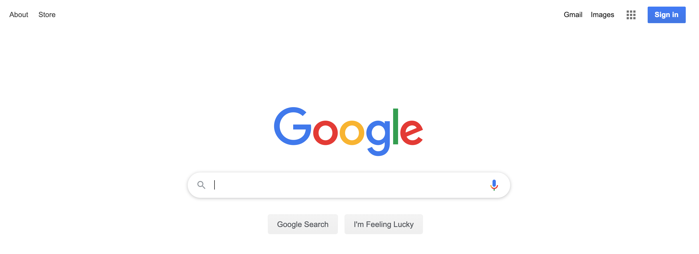
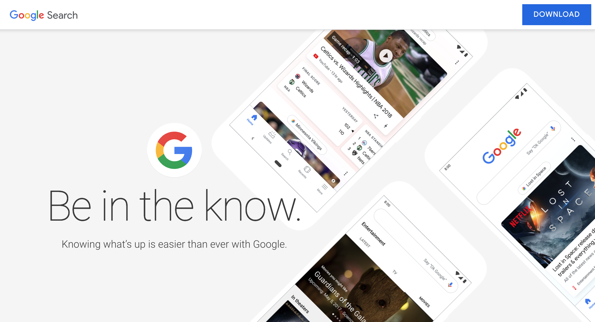
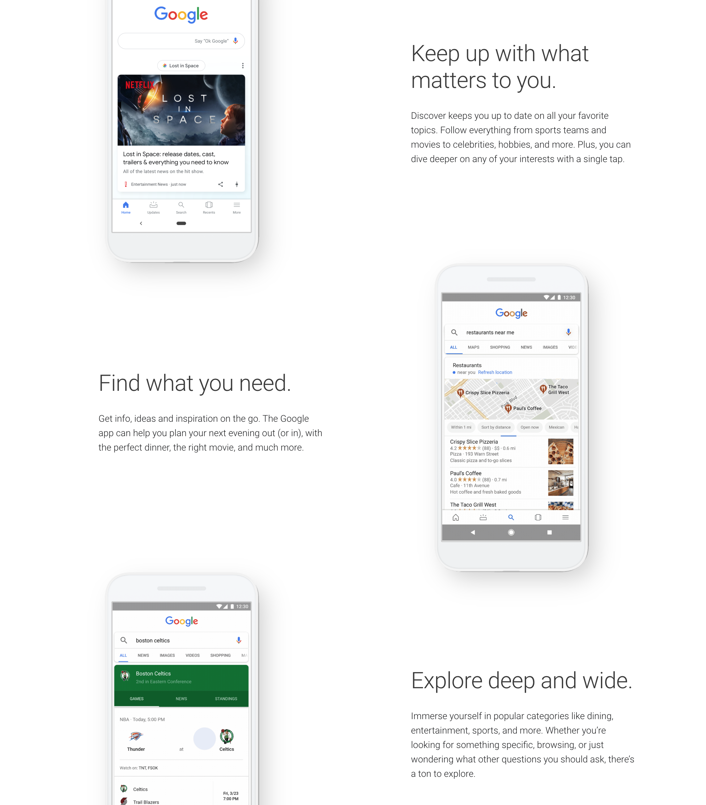

# What is a Landing Page?

The Portfolio Project landing page is a webpage that presents information about the project without requiring the visitor to signup, login, or even use the application. It is possible that the Landing Page is also the main webpage for the project.

Let’s take a closer look at what makes a great landing page.

Open an incognito browser and visit `google.com`. What do you see? The page has a few links in the header and footer section, but the majority of the page is empty except for the Google logo, a text input field, a microphone icon and two clickable buttons “Google Search” and “I’m Feeling Lucky”.

This is not a landing page. This is an application that is looking for a search term as input.

Now take a look at [https://www.google.com/search/about/](https://www.google.com/search/about/).

There is a splash banner with a tagline “Be in the know” with a logo.

As you scroll down, there are three features that are briefly explained, and a gif to help visualize the feature they are referencing. After reading the page, the webpage visitor learns that the Google Search application is meant to provide information, including current events relevant to a user’s favorite topics or location and in-depth knowledge to be explored. This page does not have a text field to take in a search term!

### Examples of Landing Pages
- [Slack](https://slack.com/)
- [Stripe](https://stripe.com/)
- [Ghost](https://ghost.org/)
- [Coinbase](https://www.coinbase.com/)

### Examples of non-Landing Pages
- [Amazon](https://www.amazon.com/)
- [Airbnb](https://www.airbnb.com/)
- [Booking.com](https://www.booking.com/)
- [Pinterest](https://www.pinterest.com/)

*note: accessed from an incognito browser*

### More information about landing pages
- [Instapage - 25 of the Best Landing Pages](https://instapage.com/blog/best-landing-page-examples)
- [Hubspot - What is a landing page](https://blog.hubspot.com/blog/tabid/6307/bid/7177/what-is-a-landing-page-and-why-should-you-care.aspx)
- [Quora – What is the difference between a landing page and a web page?](https://www.quora.com/What-is-the-difference-between-a-landing-page-and-a-website)

## Goal

Your Portfolio Project landing page is intended to:

- Share information about your project
- Tell the story about yourself as the developer
- Direct traffic to your deployed app, and your github

### Resources

You’re welcome to build your own. We recommend using [github pages](https://pages.github.com/). Select “Project site” to see instructions for creating a landing page for a repo.

If you would instead like to use an external service, here are some free options:

- [Wix](https://www.wix.com/)
- [MailChimp](https://mailchimp.com/features/landing-pages/)
- [QuickPages](https://quickpages.co/)

## Tasks

### 0. Share link to landing page and deployed app or video demo.

Share two links here:

1. Landing page URL
2. Deployed project page URL, or link to a Youtube video of a demo of the app

### 1. Intro section

On page load, your project is introduced with:

- A large cover image
- The name of your project
- A one-line phrase and/or description of your project
- Navigation elements in the header bar to access each section you’ve defined (please have at least 2)
- A labeled button that navigates to the deployed project application.

### 2. Feature Section

Somewhere following the intro section, include a section where the landing page highlights 3 key features.

For each feature include:

- An image, screenshot, gif, or video
- The name of the feature
- A description of the feature

### 3. About Section

Somewhere following the feature section, include an About section.

This about section needs to include:

- A description of what inspired the project. Make this is a personal story, and not “because Holberton required this project”. It is reasonable to include the timeline, and feel free to also mention this is a Portfolio Project for Holberton School with a link.
- Links to each team member’s LinkedIn, github and Twitter profile
- A link to the github repository for the project

### 4. Optional

Add a video to your landing page that includes:

- An introduction to each of your team members
- Explains the story of what inspired your project
- Walks through 1-3 of the features
- Talks about what comes next for your project
