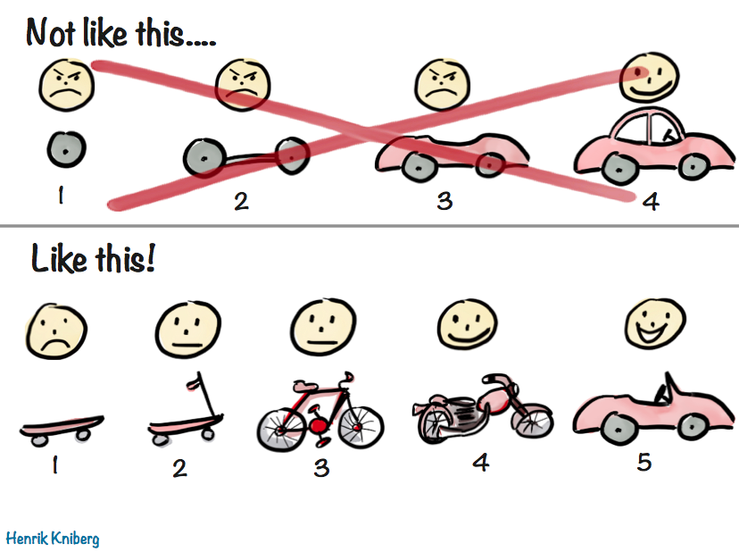
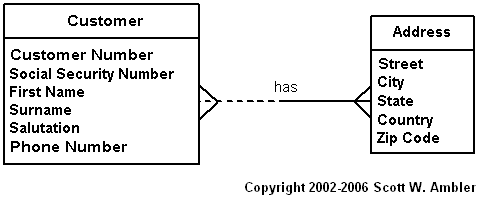
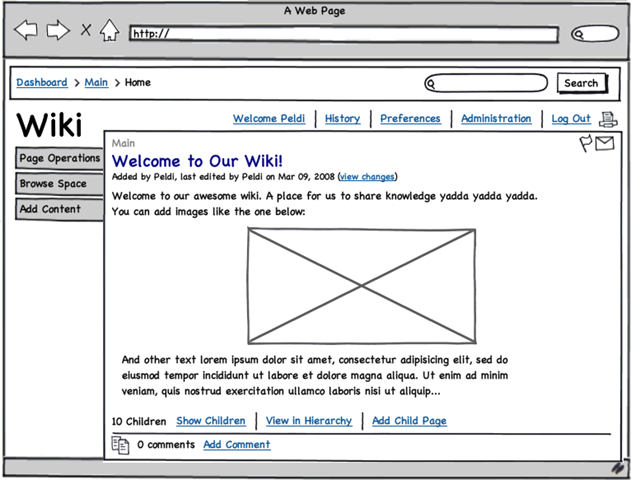

# Concepts

*For this project, we expect you to look at these concepts:*

- [3 Ways to Make a Portfolio Project Great](https://intranet.alxswe.com/concepts/135)
- [Portfolio Project Overview](https://intranet.alxswe.com/concepts/137)
- [Maze project](https://intranet.alxswe.com/concepts/133)
- [Research & Project Approval Overview](https://intranet.alxswe.com/concepts/138)



**What’s the Minimum Viable Product (MVP)?**

“A minimum viable product has just enough core features to effectively deploy the product, and no more.” – Wikipedia

Now that the team and the challenge are well defined, it is time to create a specification for the first version of your software. This is important because it is an opportunity to get the scope of the project right. If a project is too small in scope, it does not serve as an opportunity to expand your technical understanding, or present as impressive. When a project is too large in scope, the project will likely be incomplete by the end of the 2 weeks.

**Some things to think about**

**User Experience**

Remember that one of the most important users to consider will be the recruiter and hiring manager that will be evaluating your work. It may be helpful to think through a user experience that can be accessed without creating an account or giving personal details.

**Scope**

For this project, consider that it is better to end up with something a bit smaller in scope that has undergone a couple (or at least one) iteration of deployment, testing and bug fixes. Documentation is also a big bonus!

**Shortcuts**

It is fine to find ways to speed up development by taking shortcuts, but it’s important to state these openly, and have a plan in place to amend these if there is time. An example might be to first read and write from files without using a database (as you did with Airbnb at first), or hard-coding some values. This might be a good strategy if the real challenge of your software lies elsewhere, and you want to first create an end-to-end proof of concept to demonstrate feasibility.

## Default Project

If you do not have an idea, and do not submit a proposal or do not gain approval for your proposed projects, you’ll be expected to complete the 2D Game: **The Maze** - concept page available on top of this project.

## Tasks

### 0. Share your MVP specification!

Share a link here to a **NEW** Google Document where each of the following tasks are addressed.

### 1. Rename the document

Rename the document to be the Project’s name and append “ MVP specification”

### 2. Architecture

In a section named “Architecture”:

- Include an illustration or diagram of the Portfolio Project’s MVP. This should include an end-to-end map for the data flowing through your system. Each part of the diagram should be clearly labeled.

Here are some resources to learn more:

- [Web Architecture 101](https://intranet.alxswe.com/rltoken/-jOY1yTSoVvysinRHQPrwQ)
- [List of tools to create architecture diagrams](https://intranet.alxswe.com/rltoken/kId2ReF-SoHUZyFEoC9zaA)
- [Web Application Architecture](https://intranet.alxswe.com/rltoken/TmbJuwX1d6XsSd2Ppr6pSg)

### 3. APIs

In a section called “APIs and Methods”:

- List and describe the API routes that you will be creating for your web client to communicate with your web server

```
Example:
/api/rewards
GET: Returns a randomized array of ten rewards based on rarity for a user to win based on a roll POST: Takes a user id and reward id and adds that to the user rewards table
/api/user
GET: Returns the user's information based on session id
/api/job_search
POST: Returns job's matching the parameters through GitHub Jobs API
```

- List and describe any API endpoints or function/methods that you will be creating to allow any other clients to use:

```
Example:
class arrow.arrow.Arrow(year, month, day, hour=0, minute=0, second=0, microsecond=0, tzinfo=None)
An Arrow object.
Implements the datetime interface, behaving as an aware datetime while implementing additional functionality.

Parameters
year – the calendar year.
month – the calendar month.
day – the calendar day.
hour – (optional) the hour. Defaults to 0.
minute – (optional) the minute, Defaults to 0.
second – (optional) the second, Defaults to 0.
microsecond – (optional) the microsecond. Defaults 0.
tzinfo – (optional) A timezone expression. Defaults to UTC.
(source https://arrow.readthedocs.io/en/latest/#api-guide)
```

- List and describe any 3rd party APIs that you will be using

```
e.g. https://developer.twitter.com/en/docs/tweets/post-and-engage/overview
POST statuses/update
POST statuses/destroy/:id
GET statuses/show/:id
GET statuses/oembed
GET statuses/lookup
```

If there are no APIs used or provided, skip this section.

### 4. Data Modelling

In a section named “Data Model”:

- Create a data model diagram to clarify how data will be stored

Tools: [SqlDBM](https://intranet.alxswe.com/rltoken/6NDhFhDLlvGnO5IQPjNxsA)

Example: 

### 5. User Stories

First, research what [user stories](https://intranet.alxswe.com/rltoken/MP_p24nJnvQxErkP0IpZtA) are, and how to write them. Also note [some pitfalls](https://intranet.alxswe.com/rltoken/FLr9JQQFgm0zz3ZEfqKCwA) of creating user stories that are too general.

In the “User Stories” section:

- Define 3-5 detailed user stories that will be satisfied when your MVP is complete.

6. Mockups



If there is any visual interface to your Portfolio Project, this section is required. If your project lives on the commandline, or in script, then do not include this section. Use a prototyping tool, like [Balsamiq](https://intranet.alxswe.com/rltoken/gr0KAmc8Pgs7IMawbJtlIQ), to draft your user-facing visual interfaces.

In a section called “Mockups”:

- Include a mockup of each view that will need to be created for your MVP
