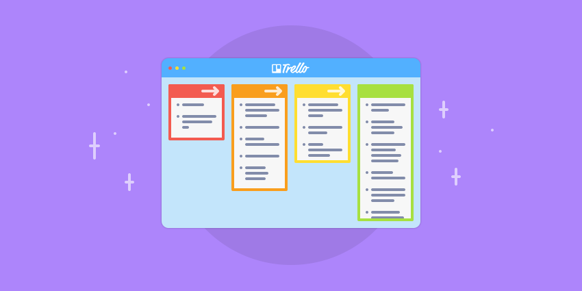
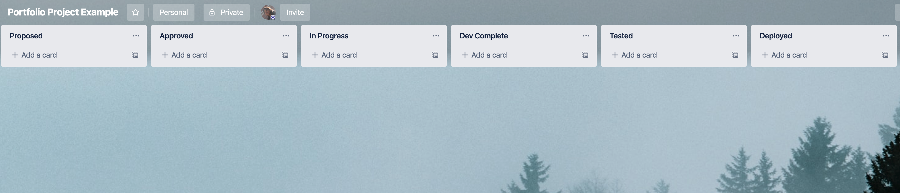
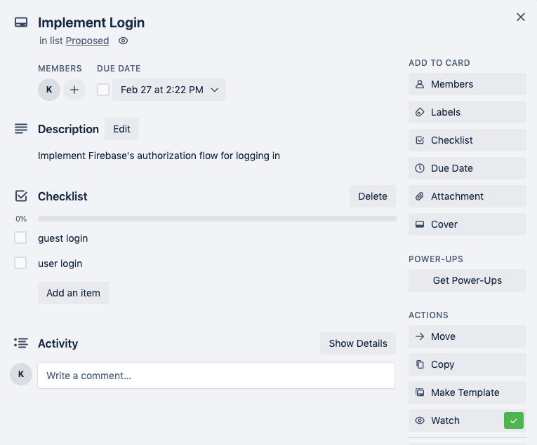
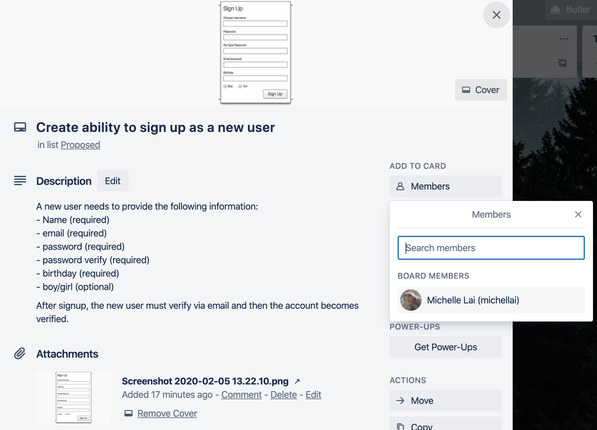
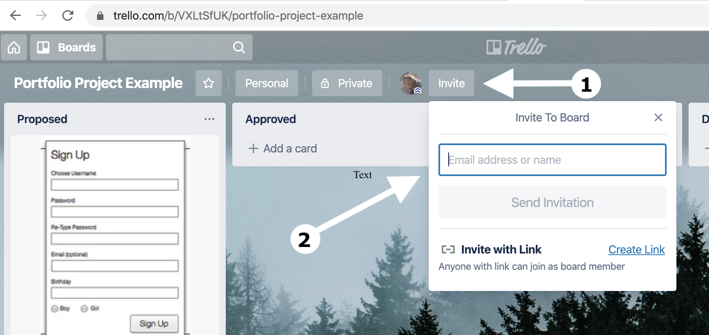
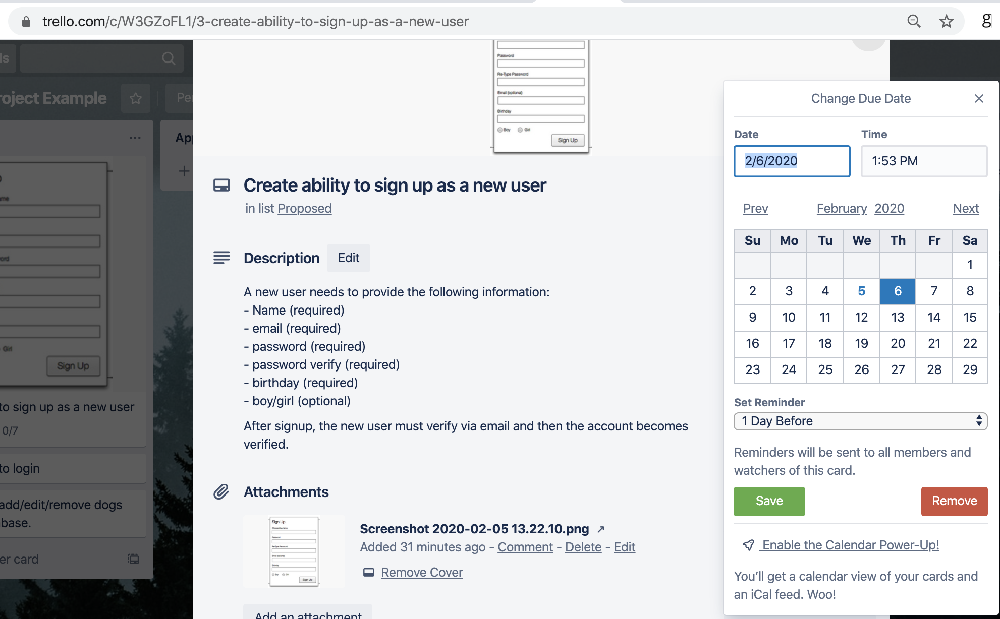
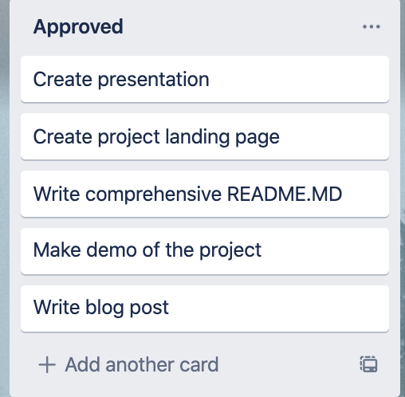

# Concepts

*For this project, we expect you to look at this concept:*

- [Maze project](https://intranet.alxswe.com/concepts/133)

## What’s a Portfolio Project?

The Portfolio Project will be a project you will showcase on your resumé, online, and during interviews. A completed Portfolio Project will consist of:

- A landing page describing your project
- A comprehensive `README.md`
- A demo of the project
- A presentation
- A blog post

## Why build a Portfolio project?

The Portfolio Project serves several different purposes:

1. Highlights a Student’s unique interests and background when networking, or interviewing with potential employers.
2. Provides a realistic workplace scenario where engineers create a solution to fit loosely defined requirements, break this down into concrete tasks and implement on a deadline.
3. Allows for self-directed learning to explore a new technical topic, deepen understanding of a curriculum-covered topic, or use technology to bring an idea to life.

## Timeline and checkpoints

Projects can be developed alone, or in teams of up to 3 students. The technologies and project concept are defined by the student teams.

Research & project approval (Part 1-3)

- Week 1: Project proposal (staff review, approval required)
- Week 2: MVP (Minimum Viable Product) proposal (staff review, approval required)
- **Week 3: [Trello](https://intranet.alxswe.com/rltoken/nHPXY_uuCJ8h-diK1DoyJw) board (staff review, approval required)**

Build Portfolio Project

- Week 4: Development
- Week 5: MVP completed (staff review, approval required)
- Week 6: Landing page deployed, final presentation delivered (staff review, approval required)

- Week 7: Blog post reflection (peer review)

## What’s the Trello board?

[Trello](https://intranet.alxswe.com/rltoken/nHPXY_uuCJ8h-diK1DoyJw) is a free project management software that uses a [kanban board](https://intranet.alxswe.com/rltoken/WBoV3Vg98rcrkt2AIa524w) to visually track the implementation of a feature set from “to-do” to “done”. Trello makes it easy to assign tasks, collaborate and collect notes in a central location.

There are other project management tools, such as [Asana](https://intranet.alxswe.com/rltoken/H9I1VYSF8kdMXVuo9d9iPQ), [Airtable](https://intranet.alxswe.com/rltoken/Q8gCI02YehO3Z_vWdDvllg), and [Jira](https://intranet.alxswe.com/rltoken/Vx-2zvCZYFhArPb1v4X7aQ). Trello has been selected for ease of use and ability to visualize progress.

## Some things to think about

**Scope of tasks**

Creating well-scoped tasks is a skill that requires practice. Also explore creating subtasks within a task.

**Dependencies**

Some tasks will rely on other ones to first be completed. Other tasks can be done in parallel but may require integration with other components along the way. Define your tasks with dependencies in mind.

**Priority**

Similar to thinking about dependencies, it will also be important to complete the highest-risk part of your software first to ensure that the central workflows of your software can be completed. It may make sense to prioritize tasks that the team is least knowledgeable about, or require the greatest resources.

**Default Project**

If you do not have an idea, and do not submit a proposal or do not gain approval for your proposed projects, you’ll be expected to complete the 2D Game: **The Maze** - concept page available on top of this project.

## Tasks

### 0. Share your Trello board!

Share a link here to a public Trello board where each of the following tasks are addressed.

### 1. Column Headers

Set up your Trello board with the following columns:

- Proposed
- Approved
- In Progress
- Dev Complete
- Tested
- Deployed

Example:

### 2. Create Cards

In the “proposed” column, create cards to fully represent the engineering tasks necessary to implement to satisfy the User Stories defined for your MVP. For each card, attach detailed descriptions, mockups, diagrams or technical specifications relevant to the engineering task.

### 3. Assign cards

For each card, assign ownership to a team member. This should make sense given the roles specified in the project proposal.

### 4. Invite collaborators

Invite the technical staff to be a collaborator on the Trello board so that each proposed task can be commented upon and moved into the approved column.

### 5. Set Due Dates

For each task, based on priority and dependencies, assign a due date within the 2 week development window.

### 6. Add a few mandatory tasks

Include the following tasks to the “Approved” column:

- Create presentation
- Create project landing page
- Write comprehensive `README.md`
- Make demo of the project
- Write blog post

