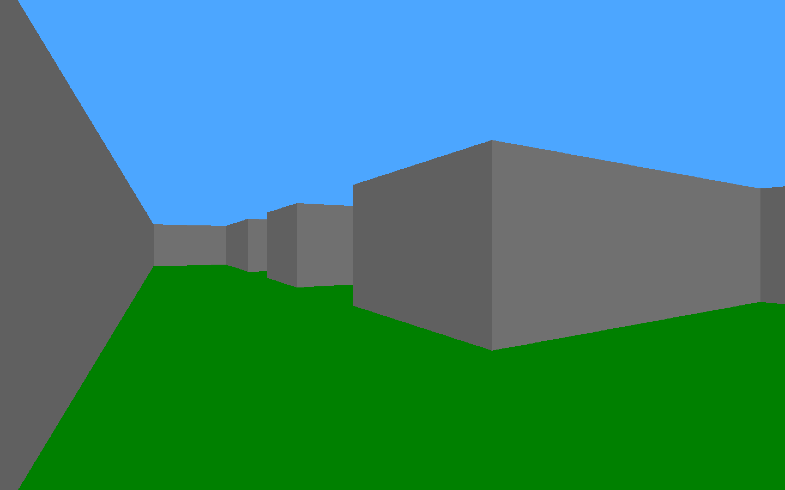
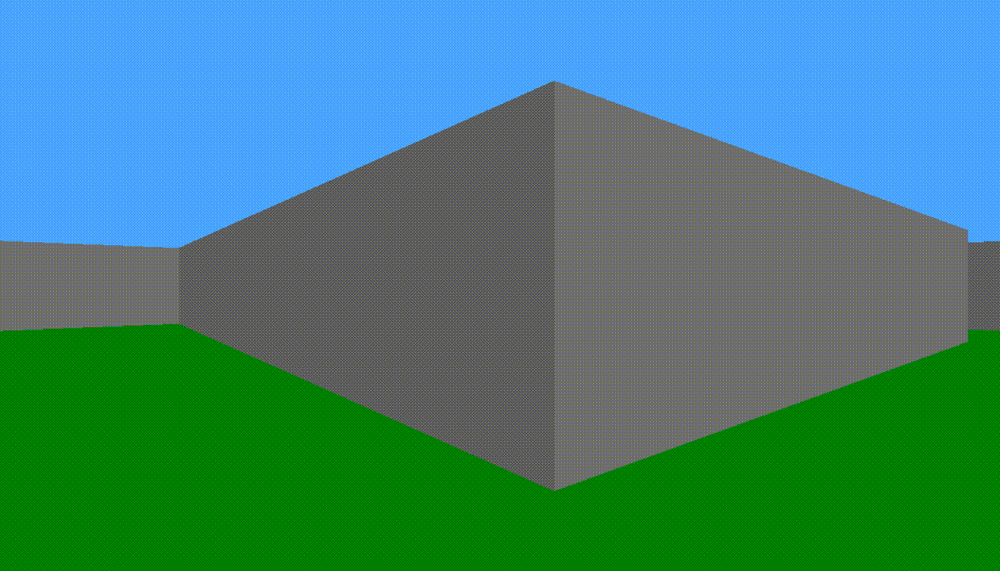
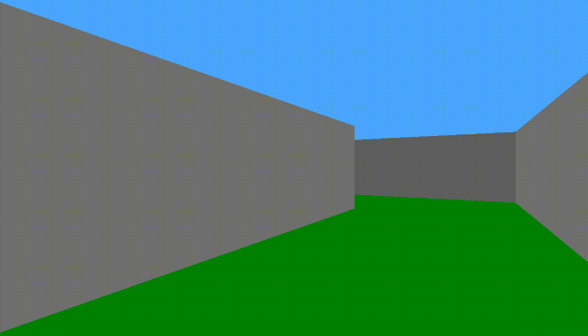
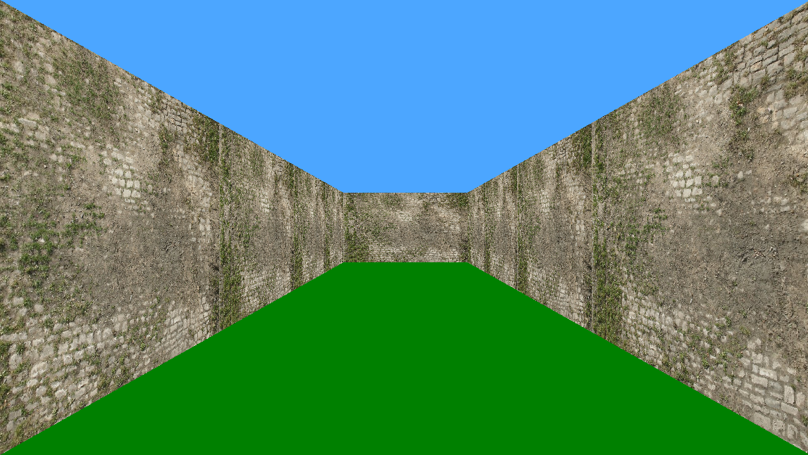
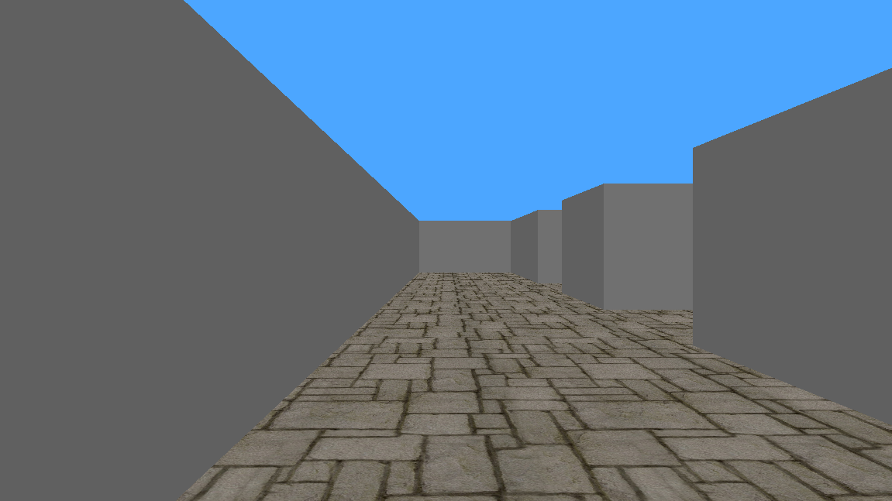
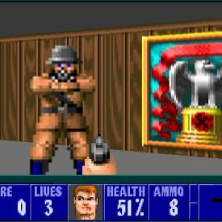

# Maze project

## Background Context

The goal of this project is to create a game in 3D using raycasting !

You don’t have to do the tasks in order, except for the first one (obviously), or if a task depends on a previous one

You have a link to a very good and very long tutorial about raycasting in the `Tips and links` section below, so read it very carefully, and practice !

Please have a lot of fun doing this project !

# Requirements

## General
- All your files will be compiled on Ubuntu 14.04 LTS, using gcc (Ubuntu 4.8.4-2ubuntu1~14.04) 4.8.4
- We will use the **gcc flags** `-Wall` `-Werror` `-Wextra` and `-pedantic`
- All your functions must be commented
- Your functions should be **maximum 40 lines** long (one statement per line)
- Your functions should be **maximum 80 columns** long
- No more than **5 functions** per file

# Betty
- Your entire repository will be checked using [Betty](https://intranet.alxswe.com/rltoken/f6sw5PyQ4Mj4FUVBRdAfXg)
- Don’t push any object files `.o` or temporary files `*~`, or any unused source file if you don’t want to lose points !
- It is advised to always keep a clear organisation in your repository. For example, store all your sources in a `src` directory, and all your headers in a `inc`, `headers` or `dependencies` folder

# More Info

**Tips and links**

- [SDL2 - Get started.pdf](https://intranet.alxswe.com/rltoken/pMnvq93vpbAh9q6inKQMuQ)
- [SDL2 tutorials](https://intranet.alxswe.com/rltoken/oona0Kd1yVyjHQGoJaV_aw)
- Be careful with tutorials/help online: We are using `SDL2`, and not `SDL-1.2` !
- [RAYCASTING !!!](https://intranet.alxswe.com/rltoken/vRw7CP21mUmKFDdrQjQ2GA)
- [Alternative Raycasting Tutorial](https://intranet.alxswe.com/rltoken/dnQwzgrDUEhFXIF8sNivkg)

# Important

- Don’t forget to **install SDL2** [SDL2 tutorials](https://intranet.alxswe.com/rltoken/oona0Kd1yVyjHQGoJaV_aw)
- There are no forbidden functions for this project. You are allowed to use any system call and/or standard library function.
- You are allowed to use [all the functions provided by SDL2](https://intranet.alxswe.com/rltoken/bmGynXNHzUObCE08XuoCQg)

## Tasks

### 0. Walls !

In this first part, you’ll have to:

- Create a window with SDL2
- Use [raycasting](https://intranet.alxswe.com/rltoken/vRw7CP21mUmKFDdrQjQ2GA) to draw walls on your window !
- You don’t need to be able to rotate the camera during the execution in this part, but you must provide a way to change the angle of the camera in your code to see if it works after recompiling it
- The color of the walls must be different from the color of the ground/ceil
- The map doesn’t need to be parsed from a file, but you must provide a way to modify it in your code to see if it works after recompiling it. (e.g. using an array of arrays of integers or characters).

Example:

In the following image, the camera is the red square, and the visible area is painted in green:

### 1. Orientation

In this part, you must draw a different color depending on the orientation of the walls.

- You must at least draw walls facing `NORTH` and `SOUTH` in a different color from walls facing `EAST` and `WEST`.

Example:

### 2. Rotation

You must provide a way to rotate the camera during the execution.

- For example, you can rotate the camera when the `left`, `right` arrows are pressed on the keyboard.
- Or you can rotate the camera when the mouse moves, just like a FPS game !

Example:

### 3. Move

You must provide a way to move the camera during the execution.

- For example, you can move the camera when the `w`,`a`,`s`,`d` keys are pressed on the keyboard.

Example:

### 4. Ouch !

In this part, you must handle the collisions of the player (yes, let’s call the camera `player` now, it’s getting serious) with the walls.

- The player must not be able to enter walls
- You can make the player slide on the walls instead of just stop it.

### 5. Parser

In this part you must implement a parser to get the map from a file.

- You are free to define the standards of your map (The character for a wall, the character for nothing, the extension of the file if you want, …)
- Your program will need a parameter to run which will be the path to the map file

### 6. Draw the map

In this part, you must draw the map on the window.

- You’re free to draw the map where you want, with the color you want, …
- You must provide a way to enable/disable it during the execution
- Include the player’s line of sight in the map

### 7. Coding style + Documentation

- Check if you code fits the [Holberton School coding style](https://intranet.alxswe.com/rltoken/R15Tf-sVTHL3SWCnEQ7bog).
- Check if your code is well documented and respect the [Holberton School documentation format](https://github.com/alx-tools/Betty/blob/master/kernel-doc.pl)

You can check all of this by yourself, just follow the instructions on [this repository](https://intranet.alxswe.com/rltoken/f6sw5PyQ4Mj4FUVBRdAfXg)

**Be careful**

The check will be done on each file present on your turn in repository. Even the files that was not required. So don’t forget to always keep your turn in directory clean.

### 8. Textures

In this part you have to add textures on your walls !

Example

### 9. Multi task !

Add a way to move on several directions and rotate in the same time. Basically in this part you’ll have to handle multiple events on the same frame.

For example, if the keys to move are `w`,`a`,`s`,`d`:

- If the keys `w` and `s` are pressed in the same time, the player shouldn’t move.
- If the keys `w` and `d` are pressed in the same time, the player should move forward and right in the same time,
- …

### 10. Ground textures

In this part you have to add textures on the ground and/or on the ceiling !

Example

### 11. Weapons

Add weapons textures !

Example

### 12. Enemies

Add some enemies !

Example from the game Wolfenstein 3D:

### 13. Make it rain

Add rain and a possibility to stop / start the rain with a key.

### 14. Extra option

Shadows, special lightning, etc… get creative!
